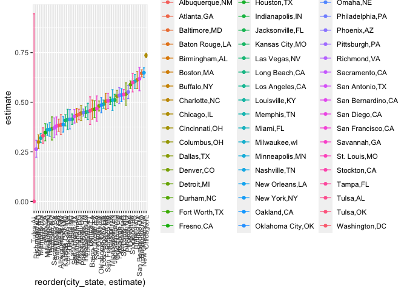

p8105_hw5_lz2951
================
lz2951
2023-11-14

``` r
library(tidyverse)
```

    ## ── Attaching core tidyverse packages ──────────────────────── tidyverse 2.0.0 ──
    ## ✔ dplyr     1.1.3     ✔ readr     2.1.4
    ## ✔ forcats   1.0.0     ✔ stringr   1.5.0
    ## ✔ ggplot2   3.4.3     ✔ tibble    3.2.1
    ## ✔ lubridate 1.9.2     ✔ tidyr     1.3.0
    ## ✔ purrr     1.0.2     
    ## ── Conflicts ────────────────────────────────────────── tidyverse_conflicts() ──
    ## ✖ dplyr::filter() masks stats::filter()
    ## ✖ dplyr::lag()    masks stats::lag()
    ## ℹ Use the conflicted package (<http://conflicted.r-lib.org/>) to force all conflicts to become errors

# Problem 1

``` r
homicide = 
  read_csv(file = "./data/homicide-data.csv")
```

    ## Rows: 52179 Columns: 12
    ## ── Column specification ────────────────────────────────────────────────────────
    ## Delimiter: ","
    ## chr (9): uid, victim_last, victim_first, victim_race, victim_age, victim_sex...
    ## dbl (3): reported_date, lat, lon
    ## 
    ## ℹ Use `spec()` to retrieve the full column specification for this data.
    ## ℹ Specify the column types or set `show_col_types = FALSE` to quiet this message.

The homicide data contains 52179 rows and 12 columns. The variable names
are uid, reported_date, victim_last, victim_first, victim_race,
victim_age, victim_sex, city, state, lat, lon, disposition. The
disposition of a homicide could be one of Closed without arrest, Closed
by arrest, Open/No arrest.

``` r
homicide_prop =
  homicide |>
  mutate(city_state = str_c(city, ",", state)) |>
  group_by(city_state, disposition) |>
  summarize(n_disposition = n()) |>
  pivot_wider(names_from = disposition, values_from = n_disposition) |>
  mutate(
    prop = list(
      tibble(
      total_number = sum(`Closed by arrest`, `Closed without arrest`, `Open/No arrest`, na.rm = TRUE), 
      unsolved_number = sum(`Closed without arrest`, `Open/No arrest`, na.rm = TRUE)
      )
    )
  )
```

    ## `summarise()` has grouped output by 'city_state'. You can override using the
    ## `.groups` argument.

``` r
homicide_prop_balti =
  homicide_prop |>
  filter(city_state == "Baltimore,MD") |>
  pull(prop) |>
  _[[1]]

prop_test_balti =
  prop.test(homicide_prop_balti$unsolved_number, homicide_prop_balti$total_number) |>
  broom::tidy()

estimated_prop_balti = pull(prop_test_balti, estimate)
conf_low_balti = pull(prop_test_balti, conf.low)
conf_high_balti = pull(prop_test_balti, conf.high)

estimated_prop_balti
```

    ##         p 
    ## 0.6455607

``` r
conf_low_balti
```

    ## [1] 0.6275625

``` r
conf_high_balti
```

    ## [1] 0.6631599

``` r
prop_test_city = function(prop) {
  test_result = prop.test(prop$unsolved_number, prop$total_number) |>
    broom::tidy(test_result)
  tibble(
    estimate = test_result$estimate,
    conf.low = test_result$conf.low,
    conf.high = test_result$conf.high
  )
}

homicide_prop =
  homicide_prop |>
  mutate(test_result = map(prop, prop_test_city)) |>
  unnest(c(prop, test_result))
```

    ## Warning: There was 1 warning in `mutate()`.
    ## ℹ In argument: `test_result = map(prop, prop_test_city)`.
    ## ℹ In group 49: `city_state = "Tulsa,AL"`.
    ## Caused by warning in `prop.test()`:
    ## ! Chi-squared approximation may be incorrect

``` r
homicide_prop |>
  ggplot(aes(x = reorder(city_state, estimate), y = estimate, color = city_state)) +
  geom_point() +
  geom_errorbar(aes(ymin = conf.low, ymax = conf.high)) +
  theme(axis.text.x = element_text(angle = 90, hjust = 1, vjust = .5))
```

<!-- -->

# Problem 2
