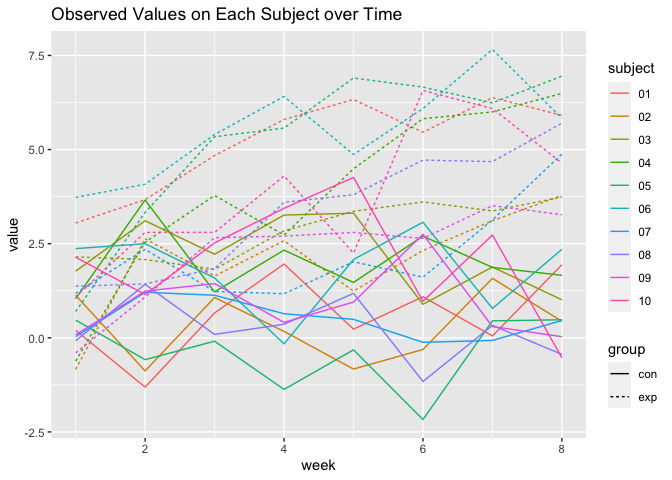
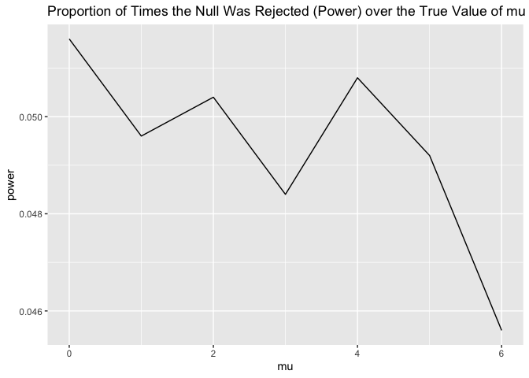
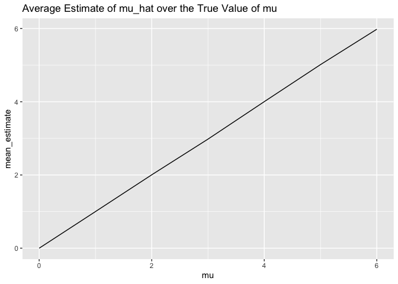
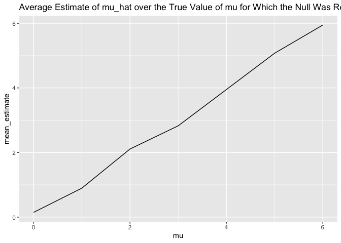

p8105_hw5_lz2951
================
lz2951
2023-11-14

``` r
library(tidyverse)
```

    ## ── Attaching core tidyverse packages ──────────────────────── tidyverse 2.0.0 ──
    ## ✔ dplyr     1.1.3     ✔ readr     2.1.4
    ## ✔ forcats   1.0.0     ✔ stringr   1.5.0
    ## ✔ ggplot2   3.4.3     ✔ tibble    3.2.1
    ## ✔ lubridate 1.9.2     ✔ tidyr     1.3.0
    ## ✔ purrr     1.0.2     
    ## ── Conflicts ────────────────────────────────────────── tidyverse_conflicts() ──
    ## ✖ dplyr::filter() masks stats::filter()
    ## ✖ dplyr::lag()    masks stats::lag()
    ## ℹ Use the conflicted package (<http://conflicted.r-lib.org/>) to force all conflicts to become errors

# Problem 1

``` r
homicide = 
  read_csv(file = "./data/homicide-data.csv")
```

    ## Rows: 52179 Columns: 12
    ## ── Column specification ────────────────────────────────────────────────────────
    ## Delimiter: ","
    ## chr (9): uid, victim_last, victim_first, victim_race, victim_age, victim_sex...
    ## dbl (3): reported_date, lat, lon
    ## 
    ## ℹ Use `spec()` to retrieve the full column specification for this data.
    ## ℹ Specify the column types or set `show_col_types = FALSE` to quiet this message.

The homicide data contains 52179 rows and 12 columns. The variable names
are uid, reported_date, victim_last, victim_first, victim_race,
victim_age, victim_sex, city, state, lat, lon, disposition. The
disposition of a homicide could be one of Closed without arrest, Closed
by arrest, Open/No arrest.

``` r
homicide_prop =
  homicide |>
  mutate(city_state = str_c(city, ",", state)) |>
  group_by(city_state, disposition) |>
  summarize(n_disposition = n()) |>
  pivot_wider(names_from = disposition, values_from = n_disposition) |>
  mutate(
    prop = list(
      tibble(
      total_number = sum(`Closed by arrest`, `Closed without arrest`, `Open/No arrest`, na.rm = TRUE), 
      unsolved_number = sum(`Closed without arrest`, `Open/No arrest`, na.rm = TRUE)
      )
    )
  )
```

    ## `summarise()` has grouped output by 'city_state'. You can override using the
    ## `.groups` argument.

``` r
homicide_prop_balti =
  homicide_prop |>
  filter(city_state == "Baltimore,MD") |>
  pull(prop) |>
  _[[1]]

prop_test_balti =
  prop.test(homicide_prop_balti$unsolved_number, homicide_prop_balti$total_number) |>
  broom::tidy()

estimated_prop_balti = pull(prop_test_balti, estimate)
conf_low_balti = pull(prop_test_balti, conf.low)
conf_high_balti = pull(prop_test_balti, conf.high)

estimated_prop_balti
```

    ##         p 
    ## 0.6455607

``` r
conf_low_balti
```

    ## [1] 0.6275625

``` r
conf_high_balti
```

    ## [1] 0.6631599

``` r
prop_test_city = function(prop) {
  test_result = prop.test(prop$unsolved_number, prop$total_number) |>
    broom::tidy(test_result)
  tibble(
    estimate = test_result$estimate,
    conf.low = test_result$conf.low,
    conf.high = test_result$conf.high
  )
}

homicide_prop =
  homicide_prop |>
  mutate(test_result = map(prop, prop_test_city)) |>
  unnest(c(prop, test_result))
```

    ## Warning: There was 1 warning in `mutate()`.
    ## ℹ In argument: `test_result = map(prop, prop_test_city)`.
    ## ℹ In group 49: `city_state = "Tulsa,AL"`.
    ## Caused by warning in `prop.test()`:
    ## ! Chi-squared approximation may be incorrect

``` r
homicide_prop |>
  ggplot(aes(x = reorder(city_state, estimate), y = estimate, color = city_state)) +
  geom_point() +
  geom_errorbar(aes(ymin = conf.low, ymax = conf.high)) +
  theme(axis.text.x = element_text(angle = 90, hjust = 1, vjust = .5))
```

<!-- -->

# Problem 2

Get file names using `list.files()` and write `read_subject()` function
used to read data according to the file names.

``` r
file_names =
  list.files(path = "./data/data")

read_subject = function(file_name) {
  path = str_c("./data/data/", file_name)
  subject_data = read_csv(path)
  
  subject_data
}
```

Apply `read_subject()` to each data file, and combine file names and
result to form a tibble. Tidy the result tibble.

``` r
con_exp_df = 
  tibble(
    subject = file_names,
    result = map(file_names, read_subject)
  ) |>
  unnest(result) |>
  separate(subject, sep = "_", into = c("group", "subject")) |>
  mutate(subject = sub("\\.csv", "", subject)) |>
  select(subject, everything()) |>
  pivot_longer(cols = week_1 : week_8, names_to = "week", values_to = "value") |>
  mutate(week = sub("week_", "", week)) |>
  mutate(week = as.numeric(week))
```

    ## Rows: 1 Columns: 8
    ## ── Column specification ────────────────────────────────────────────────────────
    ## Delimiter: ","
    ## dbl (8): week_1, week_2, week_3, week_4, week_5, week_6, week_7, week_8
    ## 
    ## ℹ Use `spec()` to retrieve the full column specification for this data.
    ## ℹ Specify the column types or set `show_col_types = FALSE` to quiet this message.
    ## Rows: 1 Columns: 8
    ## ── Column specification ────────────────────────────────────────────────────────
    ## Delimiter: ","
    ## dbl (8): week_1, week_2, week_3, week_4, week_5, week_6, week_7, week_8
    ## 
    ## ℹ Use `spec()` to retrieve the full column specification for this data.
    ## ℹ Specify the column types or set `show_col_types = FALSE` to quiet this message.
    ## Rows: 1 Columns: 8
    ## ── Column specification ────────────────────────────────────────────────────────
    ## Delimiter: ","
    ## dbl (8): week_1, week_2, week_3, week_4, week_5, week_6, week_7, week_8
    ## 
    ## ℹ Use `spec()` to retrieve the full column specification for this data.
    ## ℹ Specify the column types or set `show_col_types = FALSE` to quiet this message.
    ## Rows: 1 Columns: 8
    ## ── Column specification ────────────────────────────────────────────────────────
    ## Delimiter: ","
    ## dbl (8): week_1, week_2, week_3, week_4, week_5, week_6, week_7, week_8
    ## 
    ## ℹ Use `spec()` to retrieve the full column specification for this data.
    ## ℹ Specify the column types or set `show_col_types = FALSE` to quiet this message.
    ## Rows: 1 Columns: 8
    ## ── Column specification ────────────────────────────────────────────────────────
    ## Delimiter: ","
    ## dbl (8): week_1, week_2, week_3, week_4, week_5, week_6, week_7, week_8
    ## 
    ## ℹ Use `spec()` to retrieve the full column specification for this data.
    ## ℹ Specify the column types or set `show_col_types = FALSE` to quiet this message.
    ## Rows: 1 Columns: 8
    ## ── Column specification ────────────────────────────────────────────────────────
    ## Delimiter: ","
    ## dbl (8): week_1, week_2, week_3, week_4, week_5, week_6, week_7, week_8
    ## 
    ## ℹ Use `spec()` to retrieve the full column specification for this data.
    ## ℹ Specify the column types or set `show_col_types = FALSE` to quiet this message.
    ## Rows: 1 Columns: 8
    ## ── Column specification ────────────────────────────────────────────────────────
    ## Delimiter: ","
    ## dbl (8): week_1, week_2, week_3, week_4, week_5, week_6, week_7, week_8
    ## 
    ## ℹ Use `spec()` to retrieve the full column specification for this data.
    ## ℹ Specify the column types or set `show_col_types = FALSE` to quiet this message.
    ## Rows: 1 Columns: 8
    ## ── Column specification ────────────────────────────────────────────────────────
    ## Delimiter: ","
    ## dbl (8): week_1, week_2, week_3, week_4, week_5, week_6, week_7, week_8
    ## 
    ## ℹ Use `spec()` to retrieve the full column specification for this data.
    ## ℹ Specify the column types or set `show_col_types = FALSE` to quiet this message.
    ## Rows: 1 Columns: 8
    ## ── Column specification ────────────────────────────────────────────────────────
    ## Delimiter: ","
    ## dbl (8): week_1, week_2, week_3, week_4, week_5, week_6, week_7, week_8
    ## 
    ## ℹ Use `spec()` to retrieve the full column specification for this data.
    ## ℹ Specify the column types or set `show_col_types = FALSE` to quiet this message.
    ## Rows: 1 Columns: 8
    ## ── Column specification ────────────────────────────────────────────────────────
    ## Delimiter: ","
    ## dbl (8): week_1, week_2, week_3, week_4, week_5, week_6, week_7, week_8
    ## 
    ## ℹ Use `spec()` to retrieve the full column specification for this data.
    ## ℹ Specify the column types or set `show_col_types = FALSE` to quiet this message.
    ## Rows: 1 Columns: 8
    ## ── Column specification ────────────────────────────────────────────────────────
    ## Delimiter: ","
    ## dbl (8): week_1, week_2, week_3, week_4, week_5, week_6, week_7, week_8
    ## 
    ## ℹ Use `spec()` to retrieve the full column specification for this data.
    ## ℹ Specify the column types or set `show_col_types = FALSE` to quiet this message.
    ## Rows: 1 Columns: 8
    ## ── Column specification ────────────────────────────────────────────────────────
    ## Delimiter: ","
    ## dbl (8): week_1, week_2, week_3, week_4, week_5, week_6, week_7, week_8
    ## 
    ## ℹ Use `spec()` to retrieve the full column specification for this data.
    ## ℹ Specify the column types or set `show_col_types = FALSE` to quiet this message.
    ## Rows: 1 Columns: 8
    ## ── Column specification ────────────────────────────────────────────────────────
    ## Delimiter: ","
    ## dbl (8): week_1, week_2, week_3, week_4, week_5, week_6, week_7, week_8
    ## 
    ## ℹ Use `spec()` to retrieve the full column specification for this data.
    ## ℹ Specify the column types or set `show_col_types = FALSE` to quiet this message.
    ## Rows: 1 Columns: 8
    ## ── Column specification ────────────────────────────────────────────────────────
    ## Delimiter: ","
    ## dbl (8): week_1, week_2, week_3, week_4, week_5, week_6, week_7, week_8
    ## 
    ## ℹ Use `spec()` to retrieve the full column specification for this data.
    ## ℹ Specify the column types or set `show_col_types = FALSE` to quiet this message.
    ## Rows: 1 Columns: 8
    ## ── Column specification ────────────────────────────────────────────────────────
    ## Delimiter: ","
    ## dbl (8): week_1, week_2, week_3, week_4, week_5, week_6, week_7, week_8
    ## 
    ## ℹ Use `spec()` to retrieve the full column specification for this data.
    ## ℹ Specify the column types or set `show_col_types = FALSE` to quiet this message.
    ## Rows: 1 Columns: 8
    ## ── Column specification ────────────────────────────────────────────────────────
    ## Delimiter: ","
    ## dbl (8): week_1, week_2, week_3, week_4, week_5, week_6, week_7, week_8
    ## 
    ## ℹ Use `spec()` to retrieve the full column specification for this data.
    ## ℹ Specify the column types or set `show_col_types = FALSE` to quiet this message.
    ## Rows: 1 Columns: 8
    ## ── Column specification ────────────────────────────────────────────────────────
    ## Delimiter: ","
    ## dbl (8): week_1, week_2, week_3, week_4, week_5, week_6, week_7, week_8
    ## 
    ## ℹ Use `spec()` to retrieve the full column specification for this data.
    ## ℹ Specify the column types or set `show_col_types = FALSE` to quiet this message.
    ## Rows: 1 Columns: 8
    ## ── Column specification ────────────────────────────────────────────────────────
    ## Delimiter: ","
    ## dbl (8): week_1, week_2, week_3, week_4, week_5, week_6, week_7, week_8
    ## 
    ## ℹ Use `spec()` to retrieve the full column specification for this data.
    ## ℹ Specify the column types or set `show_col_types = FALSE` to quiet this message.
    ## Rows: 1 Columns: 8
    ## ── Column specification ────────────────────────────────────────────────────────
    ## Delimiter: ","
    ## dbl (8): week_1, week_2, week_3, week_4, week_5, week_6, week_7, week_8
    ## 
    ## ℹ Use `spec()` to retrieve the full column specification for this data.
    ## ℹ Specify the column types or set `show_col_types = FALSE` to quiet this message.
    ## Rows: 1 Columns: 8
    ## ── Column specification ────────────────────────────────────────────────────────
    ## Delimiter: ","
    ## dbl (8): week_1, week_2, week_3, week_4, week_5, week_6, week_7, week_8
    ## 
    ## ℹ Use `spec()` to retrieve the full column specification for this data.
    ## ℹ Specify the column types or set `show_col_types = FALSE` to quiet this message.

Make a spaghetti plot showing observations on each subject over time.

``` r
con_exp_df |>
  ggplot(aes(x = week, y = value, color = subject, linetype = group )) +
  geom_line() +
  ggtitle("Observed Values on Each Subject over Time")
```

<!-- -->

According to the spaghetti plot, the measured value of subjects in
control group are significantly higher than those in experimental group.
This result strongly suggests the intervention applied in experimental
arm may be effective.

# Problem 3

Write `get_t_test_result()` function to generate simulation dataset,
conduct t test and return the test result in a tidy form for one single
iteration.

``` r
get_t_test_result = function(mu, n = 30, sigma = 5, alpha = 0.05) {
  df = rnorm(n, mean = mu, sd = sigma)
  result = 
    t.test(df, mu = mu, conf.level = 1 - alpha) |>
    broom::tidy() |>
    select(estimate, p.value)
    
  result
}
```

For $\mu$ from 0 to 6, iterate the t test for 5000 times for each value
of $\mu$. Organize the result as a data frame and mark every iteration
that rejects null hypothesis (p-value \<= 0.05).

``` r
sim_result_df = 
  expand_grid(
    mu = 0:6,
    iter = 1:5000
  ) |>
  mutate(estimate_df = map(mu, get_t_test_result)) |>
  unnest(estimate_df) |>
  mutate(null_rej = p.value <= 0.05)
```

Make a plot showing the proportion of times the null was rejected (the
power of the test) on the y axis and the true value of $\mu$ on the x
axis. Describe the association between effect size and power.

``` r
sim_result_df |>
  group_by(mu, null_rej) |>
  summarize(n_result = n()) |>
  group_by(mu, null_rej) |>
  filter(null_rej == TRUE) |>
  mutate(power = n_result/5000) |>
  ggplot(aes(x = mu, y = power)) +
  geom_line() +
  ggtitle("Proportion of Times the Null Was Rejected (Power) over the True Value of mu")
```

    ## `summarise()` has grouped output by 'mu'. You can override using the `.groups`
    ## argument.

<!-- -->

According to the plot, the power of the test differs with the values of
$\mu$. The plot line has no specific pattern, but the value of power is
around 0.05, which is the $\alpha$ value set by us.

Make a plot showing the average estimate of $\hat{\mu}$ on the y axis
and the true value of $\mu$ on the x axis. Make a second plot (or
overlay on the first) the average estimate of $\hat{\mu}$ only in
samples for which the null was rejected on the y axis and the true value
of $\mu$ on the x axis. Is the sample average of $\hat{\mu}$ across
tests for which the null is rejected approximately equal to the true
value of $\mu$? Why or why not?

``` r
sim_result_df |>
  group_by(mu) |>
  summarize(mean_estimate = mean(estimate)) |>
  ggplot(aes(x = mu, y = mean_estimate)) +
  geom_line() +
  ggtitle("Average Estimate of mu_hat over the True Value of mu")
```

<!-- -->

The plot line showing the average estimate of $\hat{\mu}$ on the y axis
and the true value of $\mu$ on the x axis is linear. The estimated value
and true value of $\mu$ is almost the same.

``` r
sim_result_df |>
  filter(null_rej == TRUE) |>
  group_by(mu) |>
  summarize(mean_estimate = mean(estimate)) |>
  ggplot(aes(x = mu, y = mean_estimate)) +
  geom_line() +
  ggtitle("Average Estimate of mu_hat over the True Value of mu for Which the Null Was Rejected")
```

<!-- -->

The sample average of $\hat_{mu}$ across tests for which the null is
rejected is not equal to the true value of $\mu$. However, the different
between the estimated value and the true value is very small. This is
because the deviation of the estimated $\mu$ value from the true $\mu$
value can be bidirectional. It is possible for the estimated value to be
both greater and smaller than the true value, and the deviations in both
directions to some extent counteract each other. Nevertheless, there are
still a very small proportion of extreme values that can not be totally
counteracted. Considering the very small number of rejecting the null
hypothesis, the impact of individual extreme values on the estimated
value may be quite noticeable.
